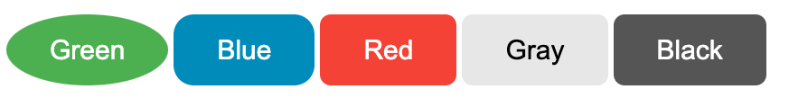

# element handling
## CSS
We can use className for css selectors
```css
.button {
    background-color: #4CAF50; /* Green */
    border: none;
    color: white;
    padding: 15px 32px;
    text-align: center;
    text-decoration: none;
    display: inline-block;
    font-size: 16px;
    margin: 4px 2px;
    cursor: pointer;
}

.button-blue {background-color: #008CBA;} /* Blue */
.button-red {background-color: #f44336;} /* Red */
.button-grey {background-color: #e7e7e7; color: black;} /* Gray */
.button-black {background-color: #555555;} /* Black */
```
```javascript
const rootElement = document.getElementById("root");
const root = ReactDOM.createRoot(rootElement);

// be aware, the entire parameter for React Components are props,
// Component({ props }) would not spread
function Button({ className, style, ...rest }) {
    return <button
        className={`button ${className}`}
        style={style}
        {...rest} 
    />;
}

const App = () => {
    // (Object) props's keys can be given as attributes in Components
    // child elements are also given as props (key: children)
    return <>
        <Button style={{ borderRadius: "50%" }}>Green</Button>
        <Button className="button-blue" style={{ borderRadius: 8 }}>Blue</Button>
        <Button className="button-red">Red</Button>
        <Button className="button-grey">Gray</Button>
        <Button className="button-black">Black</Button>
    </>;
}

root.render(<App/>);
console.log("script end")
```
Getting used to spreading props and other parameters are useful...?
```javascript
const rootElement = document.getElementById("root");
const root = ReactDOM.createRoot(rootElement);

function Button({ className, style, ...rest }) {
    // spread given styles after default styles,
    // css specificity goes selector - element - latter,
    // so style given as props have highest priority in this example
    return <button
        className={`button ${className}`}
        style={{ fontSize: 20, borderRadius: 8, ...style }}
        {...rest}
    />;
}

const App = () => {
    return <>
        <Button style={{ borderRadius: "50%" }}>Green</Button>
        <Button className="button-blue" style={{ borderRadius: 15 }}>Blue</Button>
        <Button className="button-red">Red</Button>
        <Button className="button-grey">Gray</Button>
        <Button className="button-black">Black</Button>
    </>;
}

root.render(<App/>);
console.log("script end")
```

