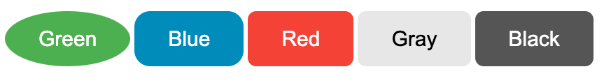

# element handling
## CSS
We can use className for css selectors
```css
.button {
    background-color: #4CAF50; /* Green */
    border: none;
    color: white;
    padding: 15px 32px;
    text-align: center;
    text-decoration: none;
    display: inline-block;
    font-size: 16px;
    margin: 4px 2px;
    cursor: pointer;
}

.button-blue {background-color: #008CBA;} /* Blue */
.button-red {background-color: #f44336;} /* Red */
.button-grey {background-color: #e7e7e7; color: black;} /* Gray */
.button-black {background-color: #555555;} /* Black */
```
```javascript
// be aware, the entire parameter for React Components are props,
// Component({ props }) would not spread
function Button({ className, style, ...rest }) {
    return <button
        className={`button ${className}`}
        style={style}
        {...rest} 
    />;
}

const App = () => {
    // (Object) props's keys can be given as attributes in Components
    // child elements are also given as props (key: children)
    return <>
        <Button style={{ borderRadius: "50%" }}>Green</Button>
        <Button className="button-blue" style={{ borderRadius: 8 }}>Blue</Button>
        <Button className="button-red">Red</Button>
        <Button className="button-grey">Gray</Button>
        <Button className="button-black">Black</Button>
    </>;
}
```
Getting used to spreading props and other parameters are useful...?
```javascript
function Button({ className, style, ...rest }) {
    // spread given styles after default styles,
    // css specificity goes selector - element - latter,
    // so style given as props have highest priority in this example
    return <button
        className={`button ${className}`}
        style={{ fontSize: 20, borderRadius: 8, ...style }}
        {...rest}
    />;
}

const App = () => {
    return <>
        <Button style={{ borderRadius: "50%" }}>Green</Button>
        <Button className="button-blue" style={{ borderRadius: 15 }}>Blue</Button>
        <Button className="button-red">Red</Button>
        <Button className="button-grey">Gray</Button>
        <Button className="button-black">Black</Button>
    </>;
}
```



## useRef / ref
in a scenario of focusing input on load with vanilla: `document.getElementById().focus();`
```javascript
const App = () => {
    React.useEffect(() => {
        document.getElementById("input").focus();
    }, []);

    return <>
        <input id="input" />
    </>;
}
```
React provides `useRef()` hook to use instead of id, which can be given as props
```javascript
const App = () => {
    const inputRef = React.useRef();
    const divRef = React.useRef();
    React.useEffect(() => {
        inputRef.current.focus();

        setTimeout(() => {
            divRef.current.style.backgroundColor = "dodgerblue"
        }, 3000);
    }, []);
    return <>
        <input ref={inputRef} />
        <div
            ref={divRef}
            style={{ height: 100, width: 300, backgroundColor: "aliceblue"}}>
        </div>
    </>;
}
```
## React forms
```javascript
const App = () => {
    const handleSubmit = (event) => {
        event.preventDefault();
        const eventElements = event.target.elements;
        alert(`FirstName: ${eventElements.fname.value}, LastName: ${eventElements.lname.value}, ChosenCar: ${eventElements.cars.value}`);
    };

    return <form onSubmit={handleSubmit}>
        <label htmlFor="fname">First name:</label>
            <br/>
        <input type="text" id="fname" name="fname" defaultValue="John" />
            <br/>
        <label htmlFor="lname">Last name:</label>
            <br/>
        <input type="text" id="lname" name="lname" defaultValue="Doe" />
            <br/>
            <br/>
        <label htmlFor="cars">Choose a car:</label>
        <select id="cars" name="cars">
            <option value="volvo">Volvo</option>
            <option value="saab">Saab</option>
            <option value="fiat">Fiat</option>
            <option value="audi">Audi</option>
        </select>
            <br/>
        <input type="submit" value="Submit" />
    </form>;
}
```
simple react form usage. `htmlFor` instead of attribute `for`, `defaultValue` instead of `value`. `onSubmit` event handler, preventDefault is still used.
```javascript
const App = () => {
    const phoneInputRef = React.useRef();
    React.useEffect(() => {
        phoneInputRef.current.focus();
    }, []);

    const [message, setMessage] = React.useState("");
    const [inputNumber, setInputNumber] = React.useState("");


    const handleSubmit = (event) => {
        event.preventDefault();
        if (inputNumber.startsWith(0)) {
            alert(inputNumber);
            setMessage("Phone Number submitted");
        } else {
            setMessage("Phone Number should start  with 0");
        }
    };

    const handleChange = (event) => {
        const eventValue = event.target.value;
        if(eventValue.startsWith(0)){
            setMessage("Phone Number is valid");
            setInputNumber(eventValue);
        } else if (event.target.value.length === 0) {
            setInputNumber("");
            setMessage("");
        } else {
            setMessage("Phone Number should start with 0")
            setInputNumber("");
        }
    }

    return <form onSubmit={handleSubmit}>
        <label htmlFor="phone">Phone Number: </label>
        <input
            id="phone"
            name="phone"
            ref={phoneInputRef}
            onChange={handleChange}
            value={inputNumber}
        />
        <p>{message}</p>
        <br/>
        <button type="submit" >Submit</button>
    </form>;
}
```
`input` elements with `value` attributes as state variables are called controlled component. Controlled components' input value is **always** driven by the React state.

## Exception (Error) Handling
We could use inherited class of `React.Component` to serve as try - catch boundaries
```javascript
class ErrorBoundary extends React.Component {
    state = { error: null };
    static getDerivedStateFromError(error) {
        return {error};
    }

    render() {
        const {error} = this.state;
        if (error) {
            return <p>Somethings wrong...</p>
        }
        return this.props.children;
    }
}

const FailingChild = () => {
    throw new Error("Deliberately thrown error");
    return <p>Child...</p>;
}

const App = () => {
    return <>
        <p>App</p>
        <ErrorBoundary>
            <FailingChild />
        </ErrorBoundary>
    </>;
}
```
and can hand down some more data as props
```javascript
class ErrorBoundary extends React.Component {
    // omitted

    render() {
        const {error} = this.state;
        if (error) {
            return this.props.fallback ?
                this.props.fallback :
                <p>Somethings wrong...</p>;
        }
        return this.props.children;
    }
}
// omitted
const App = () => {
    return <>
        <p>App</p>
        <ErrorBoundary fallback={<h1>ERROR</h1>}>
            <FailingChild />
        </ErrorBoundary>
    </>;
}
```
Error Boundaries can only be made with class components

