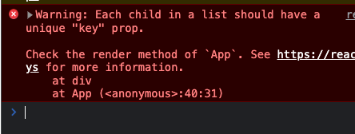
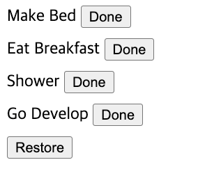

# noname

## keys and re-rendering
```javascript
const todos = [
    { id: 1, value: "Make Bed"},
    { id: 2, value: "Eat Breakfast"},
    { id: 3, value: "Shower"},
    { id: 4, value: "Go Develop"},
]

const App = () => {
    const [items, setItems] = React.useState(todos);
    const handleDoneClick = (todo) => {
        setItems(items => items.filter(item => item !== todo));
    }

    const handleRestoreClick = () => {
        if (items.length !== todos.length)
            setItems(items => [...items, todos.find(item => !items.includes(item))])
    }

    return <>
        {items.map((todo) =>
            <div style={{ marginBottom: 10 }}>
                <span>{todo.value} </span>
                <button onClick={() => handleDoneClick(todo)}>Done</button>
            </div>
        )}
        <button onClick={handleRestoreClick}>Restore</button>
    </>;
}
```
Above is a simple todo list, which would throw a warning.

Giving a key to the element within the list would shut out this warning.
```javascript
return <>
    {items.map((todo) =>
        <div key={todo.id} style={{ marginBottom: 10 }}>
            <span>{todo.value} </span>
            <button onClick={() => handleDoneClick(todo)}>Done</button>
        </div>
    )}
    <button onClick={handleRestoreClick}>Restore</button>
</>;
```
A key to an element lets React to realize that it is the same unique element instance. Above example for instance, pressing `done` and `restore` will re-order the items:
<details>
<summary>Before</summary>


</details>
<details>
<summary>After</summary>


</details>

React's re-rendering will work more efficiently when it knows that the remove - then - re-inserted are the same component.

## Lifting State Up
