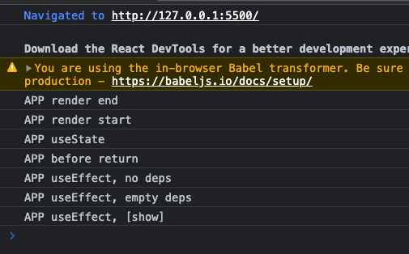
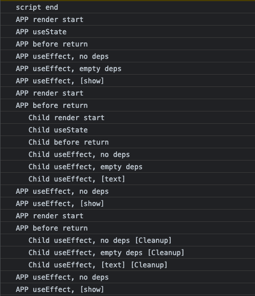
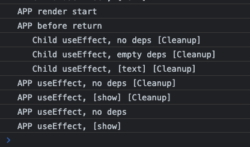

# Components and Hooks
## Components are made of elements
```html
<> 
    <input onChange={handleChange}/>
    <button onClick={handleClick}>search</button>
    <p>
        {typing ? `Looking for... ${keyword}` : result}
    </p>
</>
```
## useState()
```javascript
const rootElement = document.getElementById("root");
const root = ReactDOM.createRoot(rootElement);

const App = () => {
    // useState() returns [variable, function]
    const [keyword, setKeyword] = React.useState("");
    const [typing, setTyping] = React.useState(false);
    const [result, setResult] = React.useState("");

    function handleChange(event) {
        // calling the function changes the variable (state)
        setKeyword(event.target.value);
        setTyping(true);
    }

    function handleClick() {
        setTyping(false);
        setResult(`We find results of ${keyword}`);
    }

    // every set{State} function renders the component
    console.log("render");

    return (
        <> 
            <input onChange={handleChange}/>
            <button onClick={handleClick}>search</button>
            <p>
                {typing ? `Looking for... ${keyword}` : result}
            </p>
        </>
    );
}

root.render(<App/>);
```
`useState()` is a kind of hook used to manage states, in fact functions named `use{Something}()` are usually hooks

## useEffect()
`useState()` returns `{state}` variable and `set{State}` function as return, when we call `set{State}()` the variable value changes. If we wish to watch for the change of `{state}` variable, we could use `useEffect()`
```javascript
const [keyword, setKeyword] = React.useState(() => {
    console.log("init");
    return window.localStorage.getItem("keyword");
});
const [typing, setTyping] = React.useState(false);
const [result, setResult] = React.useState("");

React.useEffect(() => {
    console.log("effect");
    window.localStorage.setItem("keyword", keyword);
}, [keyword,]);
// omitted
```
`React.useEffect()`'s first parameter function is action, second parameter is array of `{state}` variables. On state change of variables included in second parameter, action function is called.
```javascript
// omitted
React.useEffect(() => { // this is the 'action' function
    console.log("effect");
    window.localStorage.setItem("keyword", keyword);
}, [keyword,] /* keyword is included in the second array parameter */);

function handleChange(event) {
    // every setKeyword calls invoke 'action' function
    setKeyword(event.target.value);
    // setTyping does not invoke 'action' function
    setTyping(true);
}
// omitted
```
if array for states are not given, useEffect is always invoked for setState function calls. if empty array is given, useEffect is never called except for the initial render.

## custom hook (?)
for similar useState / useEffect, consolidate them for a single custom hook `use{Name}`
```javascript
function useLocalStorage(itemName, value = "") {
    const [state, setState] = React.useState(() => {
        return window.localStorage.getItem(itemName) || value;
    });

    React.useEffect(() => {
        window.localStorage.setItem(itemName, state);
    }, [state]);

    return [state, setState];
}

const App = () => {
    const [keyword, setKeyword] = useLocalStorage("keyword");
    const [result, setResult] = useLocalStorage("result");
    const [typing, setTyping] = useLocalStorage("typing", false);
    // omitted
}
```

<details>
    <summary>full code at this point</summary>
    
```javascript
const rootElement = document.getElementById("root");
const root = ReactDOM.createRoot(rootElement);

function useLocalStorage(itemName, value = "") {
const [state, setState] = React.useState(() => {
return window.localStorage.getItem(itemName) || value;
});

    React.useEffect(() => {
        window.localStorage.setItem(itemName, state);
    }, [state]);

    return [state, setState];
}

const App = () => {
const [keyword, setKeyword] = useLocalStorage("keyword");
const [result, setResult] = useLocalStorage("result");
const [typing, setTyping] = useLocalStorage("typing", false);

    function handleChange(event) {
        setKeyword(event.target.value);
        setTyping(true);
    }

    function handleClick() {
        window.localStorage.setItem("keyword", keyword);
        setTyping(false);
        setResult(`We find results of ${keyword}`);
    }
    return (
        <>
            <input onChange={handleChange} value={keyword}/>
            <button onClick={handleClick}>search</button>
            <p>
                {typing ? `Looking for... ${keyword}` : result}
            </p>
        </>
    );
}

root.render(<App/>);
```
</details>


## hook flow
side-effects (`React.useEffect()`) is called after render. Some difference in 17 - 18 Lecture says use effect is called after `ReactDOM.render()`, but when using `ReactDOM.createRoot()` - `root.render()`, render starts after entire script



### cleanup function
returning functions as returns for `React.useEffect()` works as cleanup functions - called when element gets un-rendered (?)
```javascript
const Child = () => {
    console.log("   Child render start");
    const [text, setText] = React.useState(() => {
        console.log("   Child useState");
        return "";
    });

    React.useEffect(() => {
        console.log("   Child useEffect, no deps");
        return () => { console.log("   Child useEffect, no deps [Cleanup]"); }
    });
    React.useEffect(() => {
        console.log("   Child useEffect, empty deps");
        return () => { console.log("   Child useEffect, empty deps [Cleanup]"); }
    }, []);
    React.useEffect(() => {
        console.log("   Child useEffect, [text]");
        return () => { console.log("   Child useEffect, [text] [Cleanup]"); }
    }, [text]);


    function handleChange(event) {
        setText(event.target.value);
    }

    const element = (
        <>
            <input onChange={handleChange}/>
            <p>{text}</p>
        </>
    );
    console.log("   Child before return");
    return element;
}
```



where we can add code for cleaning up data (such as local storage)
### parent - child cleanup
Cleanup is called before useEffect, if parent `useEffect()` returns cleanup function, it is called before child `useEffect()`
```javascript
React.useEffect(() => {
    console.log("APP useEffect, no deps");
    return () => { console.log("APP useEffect, no deps [Cleanup]"); }
});
React.useEffect(() => {
    console.log("APP useEffect, empty deps");
    return () => { console.log("APP useEffect, empty deps [Cleanup]"); }
}, []);
React.useEffect(() => {
    console.log("APP useEffect, [show]");
    return () => { console.log("APP useEffect, [show] [Cleanup]"); }
}, [show]);
```



<details>
    <summary>full code at this point</summary>

```javascript
const rootElement = document.getElementById("root");
const root = ReactDOM.createRoot(rootElement);

const Child = () => {
    console.log("   Child render start");
    const [text, setText] = React.useState(() => {
        console.log("   Child useState");
        return "";
    });

    React.useEffect(() => {
        console.log("   Child useEffect, no deps");
        return () => { console.log("   Child useEffect, no deps [Cleanup]"); }
    });
    React.useEffect(() => {
        console.log("   Child useEffect, empty deps");
        return () => { console.log("   Child useEffect, empty deps [Cleanup]"); }
    }, []);
    React.useEffect(() => {
        console.log("   Child useEffect, [text]");
        return () => { console.log("   Child useEffect, [text] [Cleanup]"); }
    }, [text]);


    function handleChange(event) {
        setText(event.target.value);
    }

    const element = (
        <>
            <input onChange={handleChange}/>
            <p>{text}</p>
        </>
    );
    console.log("   Child before return");
    return element;
}

const App = () => {
    console.log("APP render start");
    const [show, setShow] = React.useState(() => {
        console.log("APP useState");
        return false;
    });

    React.useEffect(() => {
        console.log("APP useEffect, no deps");
        return () => { console.log("APP useEffect, no deps [Cleanup]"); }
    });
    React.useEffect(() => {
        console.log("APP useEffect, empty deps");
        return () => { console.log("APP useEffect, empty deps [Cleanup]"); }
    }, []);
    React.useEffect(() => {
        console.log("APP useEffect, [show]");
        return () => { console.log("APP useEffect, [show] [Cleanup]"); }
    }, [show]);

    function handleClick() {
        setShow((prev) => !prev);
    }


    const element = <>
        <button onClick={handleClick}>Search</button>
        {show ? <Child/> : <></>}
    </>;
    console.log("APP before return");
    return element;
}

root.render(<App/>);
console.log("script end")
```
</details>

observe browser logs for better understanding
