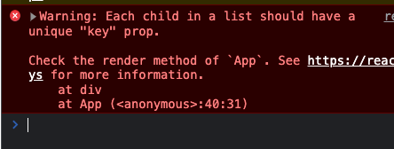
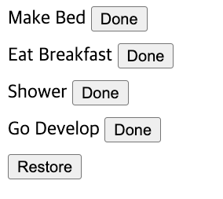
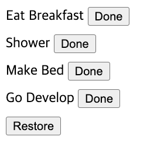

# Keys, States, Data

## keys and re-rendering
```javascript
const todos = [
    { id: 1, value: "Make Bed"},
    { id: 2, value: "Eat Breakfast"},
    { id: 3, value: "Shower"},
    { id: 4, value: "Go Develop"},
]

const TodoList = () => {
    const [items, setItems] = React.useState(todos);
    const handleDoneClick = (todo) => {
        setItems(items => items.filter(item => item !== todo));
    }

    const handleRestoreClick = () => {
        if (items.length !== todos.length)
            setItems(items => [...items, todos.find(item => !items.includes(item))])
    }

    return <>
        {items.map((todo) =>
            <div style={{ marginBottom: 10 }}>
                <span>{todo.value} </span>
                <button onClick={() => handleDoneClick(todo)}>Done</button>
            </div>
        )}
        <button onClick={handleRestoreClick}>Restore</button>
    </>;
}
```
Above is a simple todo list, which would throw a warning.



Giving a key to the element within the list would shut out this warning.
```javascript
return <>
    {items.map((todo) =>
        <div key={todo.id} style={{ marginBottom: 10 }}>
            <span>{todo.value} </span>
            <button onClick={() => handleDoneClick(todo)}>Done</button>
        </div>
    )}
    <button onClick={handleRestoreClick}>Restore</button>
</>;
```
A key to an element lets React to realize that it is the same unique element instance. Above example for instance, pressing `done` and `restore` will re-order the items:
<details>
<summary>BeforeComment</summary>


</details>
<details>
<summary>AfterComment</summary>


</details>

React's re-rendering will work more efficiently when it knows that the remove - then - re-inserted are the same component.

## Lifting State Up
A simple login form...
```javascript
const LoginForm = () => {
    const [username, setUsername] = React.useState("");
    const [password, setPassword] = React.useState("");
    const [valid, setValid] = React.useState(false);

    const handleChange = (event) => {
        const eventTarget = event.target;
        switch (eventTarget.name) {
            case "username":
                setUsername(eventTarget.value);
                break;
            case "password":
                setPassword(eventTarget.value);
                break;
            default:
                throw new Error("Unimplemented");
        }
    }

    React.useEffect(() => {
        if (username.length !== 0 && password.length !== 0) setValid(true);
        else setValid(false);
    }, [username, password]);

    return <form>
        <div>
            <label htmlFor="username">ID: </label>
            <input
                id="username"
                name="username"
                value={username}
                onChange={handleChange}
            />
        </div>
        <div>
            <label htmlFor="password">PW: </label>
            <input
                id="password"
                name="password"
                type="password"
                value={password}
                onChange={handleChange}
                style={{ marginRight: 5 }}
            />
            <button type="submit" disabled={!valid}>Login</button>
        </div>
    </form>;
}
```
then try dividing it into other Components.
```javascript
const UsernameInput = () => {
    const [username, setUsername] = React.useState("");
    const handleChange = (event) => {
        setUsername(event.target.value);
    }

    return <div>
        <label htmlFor="username">ID: </label>
        <input
            value={username}
            onChange={handleChange}
        />
    </div>;
}

const PasswordInput = (props) => {
    const [password, setPassword] = React.useState("");
    const handleChange = (event) => {
        setPassword(event.target.value);
    }

    return <div>
        <label htmlFor="password">PW: </label>
        <input
            type="password"
            value={password}
            onChange={handleChange}
            style={{ marginRight: 5 }}
        />
        {props.children}
    </div>;
}

const LoginForm = () => {
    const valid = false;
    const handleLogin = () => {

    };

    return <form>
        <UsernameInput/>
        <PasswordInput>
            <button type="submit" disabled={!valid}>Login</button>
        </PasswordInput>
    </form>;
}
```
The state of Username and Password is not reachable from App. For this situation we could hand down handleChange methods from the parent as a property, setting the state within the child Component.
```javascript
const UsernameInput = (props) => {
    return <div>
        <label htmlFor="username">ID: </label>
        <input
            onChange={props.handleChange}
        />
    </div>;
}

const PasswordInput = (props) => {
    return <div>
        <label htmlFor="password">PW: </label>
        <input
            type="password"
            onChange={props.handleChange}
            style={{ marginRight: 5 }}
        />
        {props.children}
    </div>;
}

const LoginForm = () => {
    const [username, setUsername] = React.useState("");
    const [password, setPassword] = React.useState("");
    const [valid, setValid] = React.useState(false);
    const handleLogin = (event) => {
        event.preventDefault();
        alert(`Username: ${username}, Password: ${password.split("").map(item => "*").join("")}`)
    }
    const handleChangeUsername = (event) => {
        setUsername(event.target.value);
    }
    const handleChangePassword = (event) => {
        setPassword(event.target.value);
    }

    React.useEffect(() => {
        if (username.length !== 0 && password.length !== 0) setValid(true);
        else setValid(false);
    }, [username, password]);

    return <form>
        <UsernameInput handleChange={handleChangeUsername}/>
        <PasswordInput handleChange={handleChangePassword}>
            <button
                type="submit"
                disabled={!valid}
                onClick={handleLogin}
            >Login</button>
        </PasswordInput>
    </form>;
}
```

This is called "lifting state up".

### Props Drilling
On occasions when child must know parents state, the state variable has to be handed down to the child Component. If the descendant is far away, it would cause handing the variable multiple times. This is called "drilling", opposite of lifting. This is a condition we would want to avoid.

## Fetching Data
Fetching data from a backend server. Since we don't have a server right now, we use [random-data-api](https://random-data-api.com/api/name/random_name?size=5).

```javascript
const FetchPeople = () => {
    const [data, setData] = React.useState(null);
    React.useEffect(() => {
        fetch("https://random-data-api.com/api/name/random_name?size=5")
            .then(response => response.json())
            .then(jsonBody => {
                console.dir(jsonBody);
                setData(jsonBody);
            });
    }, []);

    return <div>
        <h2>People</h2>
        {data ? data.map(item => <p key={item.id}>
            {item.first_name} {item.last_name}
        </p>) : <p>Loading...</p>}
    </div>;
}
```

It's just javascript Fetch API. Added some React style processing with `useEffect()` and `useState()`. We could also add catch, and add it to state.

```javascript
const FetchPeople = () => {
    const [data, setData] = React.useState(null);
    const [error, setError] = React.useState("");
    React.useEffect(() => {
        fetch("https://random-data-api.com/api/name/random_name?size=5")
            .then(response => response.json())
            .then(jsonBody => setData(jsonBody))
            .catch(error => setError(error.message));
    }, []);

    if (error) {
        return <div>
            <h2>
                <p>Something's wrong...</p>
            </h2>
        </div>
    }

    return <div>
        <h2>People</h2>
        {data ? data.map(item => <p key={item.id}>
            {item.first_name} {item.last_name}
        </p>) : <p>Loading...</p>}
    </div>;
}
```

Note that javascript Fetch API **does not throw error on status codes !== 200**, so we need to throw them manually. Consult [MDN Fetch API Reference](https://developer.mozilla.org/en-US/docs/Web/API/Fetch_API/Using_Fetch#checking_that_the_fetch_was_successful) for details.
```javascript
const FetchPeople = () => {
    const [data, setData] = React.useState(null);
    const [error, setError] = React.useState("");
    React.useEffect(() => {
        fetch("https://random-data-api.com/api/name/random_name?size=5")
            .then(response => {
                if (!response.ok) throw new Error("response not OK");
                return response.json()
            })
            .then(jsonBody => setData(jsonBody))
            .catch(error => setError(error.message));
    }, []);

    if (error) {
        return <div>
            <h2>
                <p>Something's wrong...</p>
            </h2>
        </div>
    }

    return <div>
        <h2>People</h2>
        {data ? data.map(item => <p key={item.id}>
            {item.first_name} {item.last_name}
        </p>) : <p>Loading...</p>}
    </div>;
}
```
