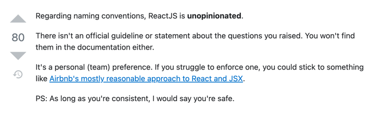

# Chapter 2
Checkout React official docs (basics).

## Directory Structure

### stub-project

First created React APP with npx,
```shell
npx create-react-app my-app
```
Then renamed it to `stub-project`.
```text
stub-project/src
├── App.css
├── App.js
├── App.test.js
├── components
│   └── 4-props
│       ├── Composition.jsx
│       └── Extraction
│           ├── AfterComment.jsx
│           └── BeforeComment.jsx
├── index.css
├── index.js
├── logo.svg
├── reportWebVitals.js
└── setupTests.js
```
Add sub-chapter outputs to sub-directories of `components` as above.

### Note Directories
Will try to add directories same way as chapter 1, but probably no index.html.

### OMFG...



This would mean different naming convention for different maintainer, but most people seems to follow [Airbnb style](https://github.com/airbnb/javascript/blob/master/react/README.md#naming). So try to follow that, although some wording needs more understanding of js import syntax and React Components 
